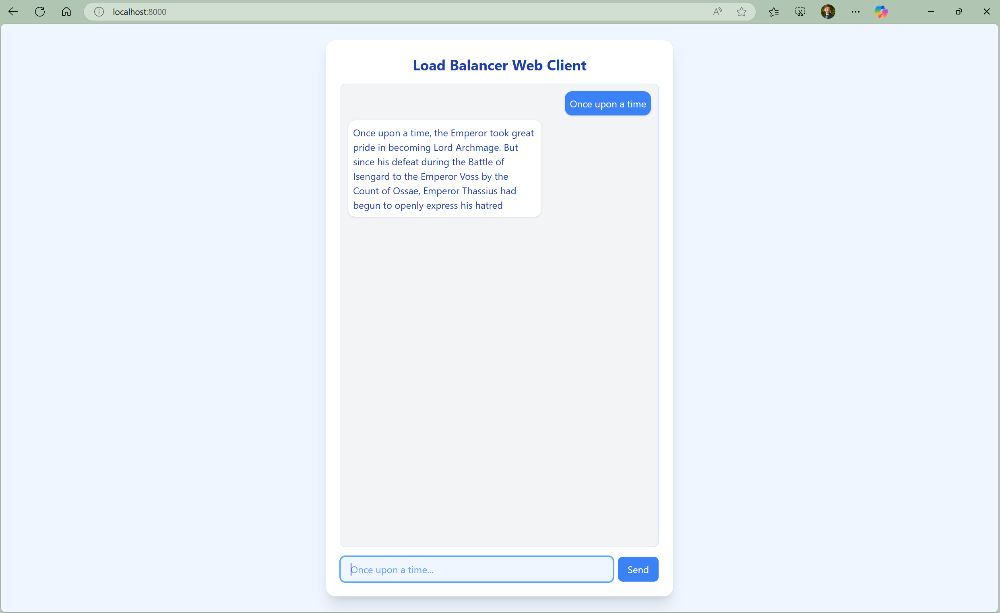

# AI Load Balancer
A load balancer specifically geared towards LLM usage. 

**Authors**: Blaise Swartwood & Jared Kagay

**Repo**: https://github.com/blaiseswartwood/AILoadBalancer

## Features

- **ChatGPT-2 Server Backend**
  - Utilizes basic LLM model that finishes stories based on the starting line, e.g. "Once upon a time,"
  - Dynamically connects to the load balancer on startup
 
- **Server Heartbeats**
  - Periodically sends heartbeats back and forth with the load balancer to communicate if either service is down
  - Initially makes multiple attempts to connect to the load balancer if a connection cannot be formed

- **Python-Based Load Balancer**
  - Round-Robin Algorithm: requests are made cyclically with each connected server
  - Least Connections: requests are made based on which connected server is servicing the least amount of clients
 
- **Semantic LRU Caching**
  - Load balancer stores recent responses in a cache and then bypasses the servers if a similar request is made
  - Cache Hits are based off of semantic similarity, where prompts with similar meanings are considered to be the same

- **Async/Await Implementation**
  - Utilizes async/await methods to handle multiple connections, as well as other background tasks like heartbeats
  - Avoids concurrency and synchronization bugs that are caused by a threading strategy

- **Versatile Client Frontend**
  - All socket connection/send/receive commands can be done using a simple client interface using our custom API
  - Additional web-based client using WebSockets and a TCP connection with the load balancer

## Setup

Make a virtual environment:

```powershell
python -m venv venv
.\venv\Scripts\activate.ps1
```

Install packages if not already installed:

```powershell
pip install huggingface_hub transformers torch uvicorn
```

Generate a huggingface token and allow use of GPT2:

```powershell
notepad $PROFILE
$env:HF_TOKEN = 'your_token_here'
```

## Usage

1. Start the load balancer
- the load-balancing algorithm can be specified by `-r` for Round Robin and `-c` for Least Connections
- the selected port is always 1234, which allows the servers to connect automatically on startup

```powershell
>>> python .\load_balancer.py -r
Using Round Robin algorithm
Device set to use cpu
Using Round Robin algorithm
Load Balancer on port 1234 running on localhost
```

2. Start a server
- specify the port for the server as the first argument
- ideally, multiple servers are started to properly demonstrate the load balancing
```powershell
>>> python .\server.py 1235
Logging into HuggingFace Hub...
Loading LLM model...
Device set to use cpu
Model loaded successfully.
Clients may now connect to the server.
Server on port 1235 connecting to the load balancer      
Server on port 1235 registered with load balancer on localhost:1234
Server on port 1235 serving clients
Server on port 1235 running on localhost
Server on port localhost sending heartbeat to load balancer: HEARTBEAT 0
```
- You will see the following output on the load balancer:
```powershell
...
Load balancer received connection on port 52591
Added server on port 1235
Server registered: localhost:1235
Started heartbeat listener for localhost:1235
Received heartbeat from localhost:1235: HEARTBEAT 0  
```

3. start a client
- specify the host and port number for the **load balancer** as the first and second arguments
- ideally, multiple clients are started to properly demonstrate the load balancing
```powershell
>>> python .\client.py localhost 1234
 -> 
```
- You will see the following output on the load balancer:
```powershell
Load balancer received connection on port 52614
Load balancer knows that this is a client
Load balancer received client on port 52614
Server localhost:1235 selected for request
Load balancer connected to backend server on port 1235   
Total active connections: 1
```

4. Make a request from the client

```powershell
 -> Once upon a time
```
- You will first see the response on the server:
```powershell
Server on port 1235 received from port 52615: 7729cb5a-084c-4071-b454-d1ed31ba185a|Once upon a time
LLM receiving: Once upon a time
Generating response...
Setting `pad_token_id` to `eos_token_id`:50256 for open-end generation.
LLM Response: Once upon a time, the Emperor took great pride in becoming Lord Archmage. But since his defeat during the Battle of Isengard to the Emperor Voss by the Count of Ossae, Emperor Thassius had begun to openly express his hatred
Server on port 1235 sending back data to port 52615: 7729cb5a-084c-4071-b454-d1ed31ba185a|Once upon a time, the Emperor took great pride in becoming Lord Archmage. But since his defeat during the Battle of Isengard to the Emperor Voss by the Count of Ossae, Emperor Thassius had begun to openly express his hatred
```
- You will then see an output similar to this on the load balancer:
```powershell
Cache miss - no semantic similarity!
Cache miss!
Sending off payload:  7729cb5a-084c-4071-b454-d1ed31ba185a|Once upon a time
Adding to cache:  Once upon a time, the Emperor took great pride in becoming Lord Archmage. But since his defeat during the Battle of Isengard to the Emperor Voss by the Count of Ossae, Emperor Thassius had begun to openly express his hatred
```
- Finally, the response will make it back to the client:
```powershell
GPT2 Response:
 Once upon a time, the Emperor took great pride in becoming Lord Archmage. But since his defeat during the Battle of Isengard to the Emperor Voss by the Count of Ossae, Emperor Thassius had begun to openly express his hatred
 -> 
```

4. Try connecting and disconnecting from clients, sending different or similar requests, and a different load balancing algorithm! 

5. Alternatively, try the web-based frontend by entering the frontend directory and using uvicorn:

```powershell
>>> cd frontend
>>> uvicorn app:app
INFO:     Started server process [25992]
INFO:     Waiting for application startup.
INFO:     Application startup complete.   
INFO:     Uvicorn running on http://127.0.0.1:8000 (Press CTRL+C to quit)
```

- Then, open the client in your browser using the link given on Uvicorn. The prompts work as expected.


